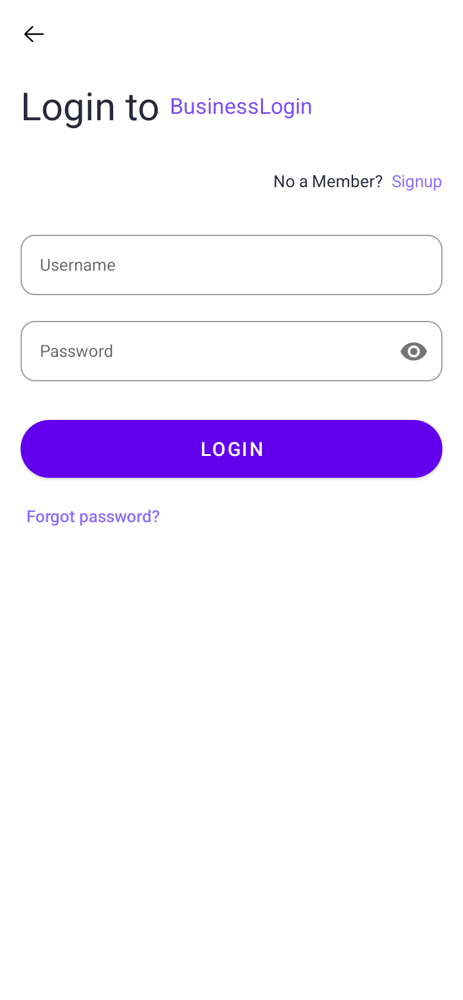
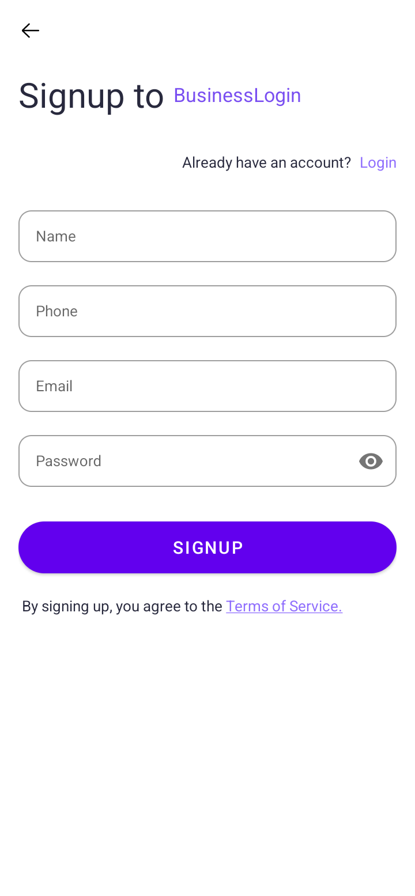
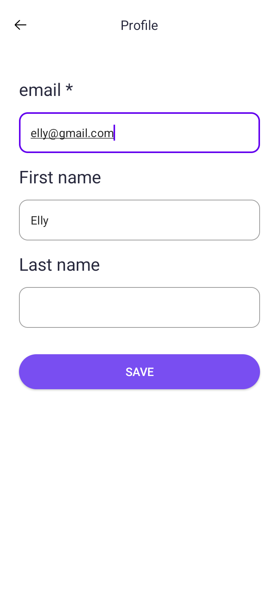
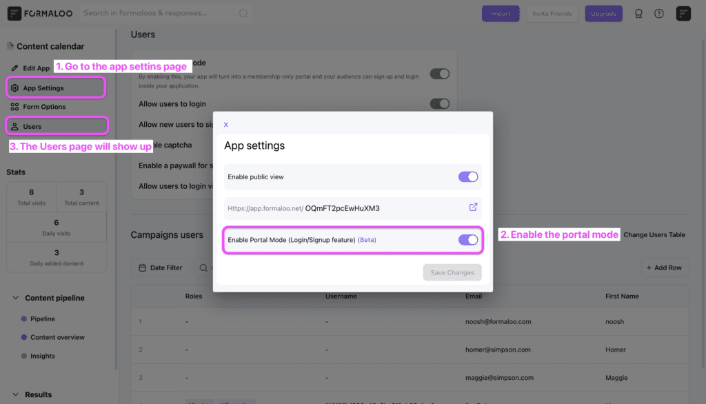

# App Authentication

Each user has the option to create an application that includes the functionality to allow users to sign up and log in to the application.

<table>
<tr>
<td align="center"></td>
<td align="center"></td>
<td align="center"></td>
</tr>
</table>

Once you have completed the creation of your app, go to the "App Settings" page located within the app on the website and turn on the portal mode feature.
By doing this, a new page called "Users" will be created, appearing above your existing menu items.

<table>
<tr>
<td align="center"></td>
</tr>
</table>

If you would like to learn how to add login and sign up features to your app, please click on the following link to access a tutorial that provides detailed instructions:
https://www.formaloo.com/en/5-steps-to-add-login-and-sign-up-to-your-no-code-app/

By importing the boardAuthentication module into your project, you can incorporate authentication pages into your application.
Additionally, if you prefer to use your own UI design, you can simply use the data folder without the pre-built authentication pages.

Please refer to the API document for further information:
https://staging.dev.formaloo.com/#/operations/endUsersSignupCreate
